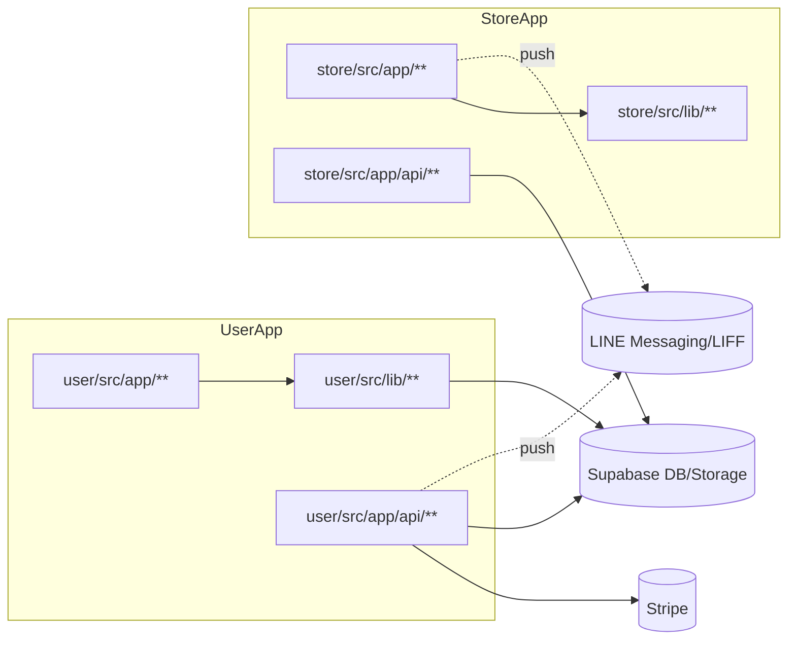
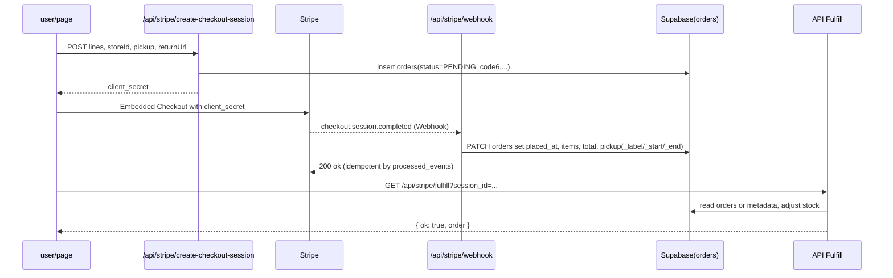
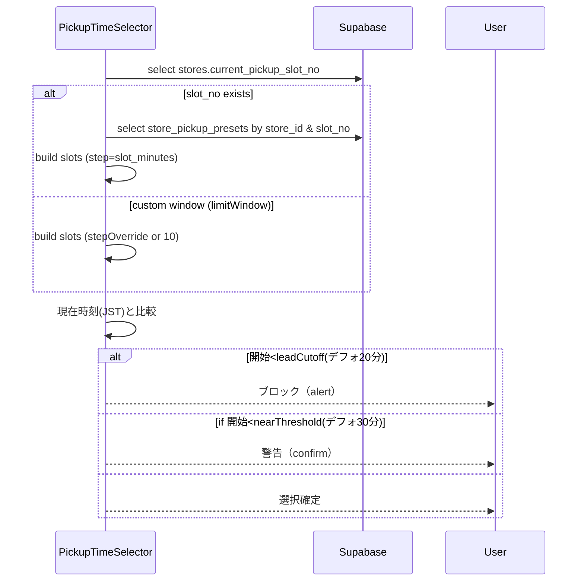
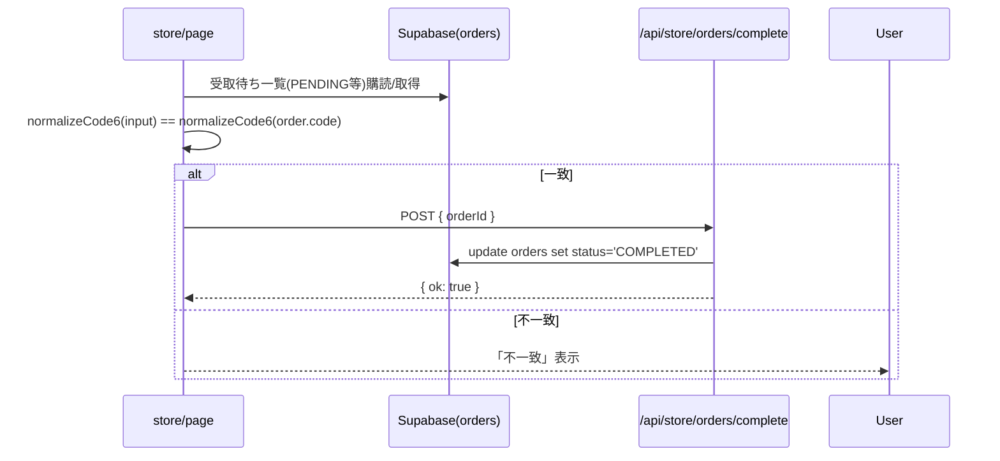
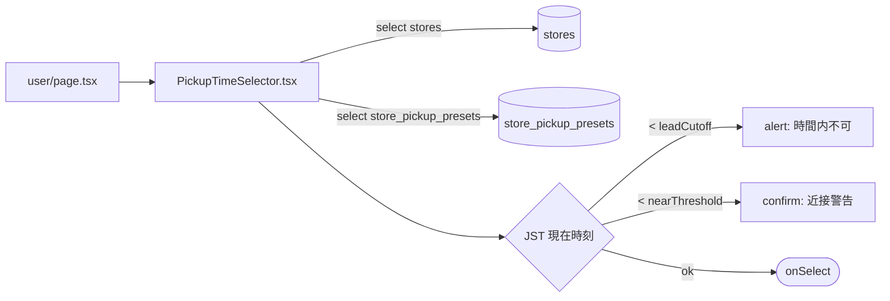
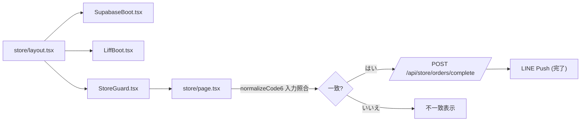
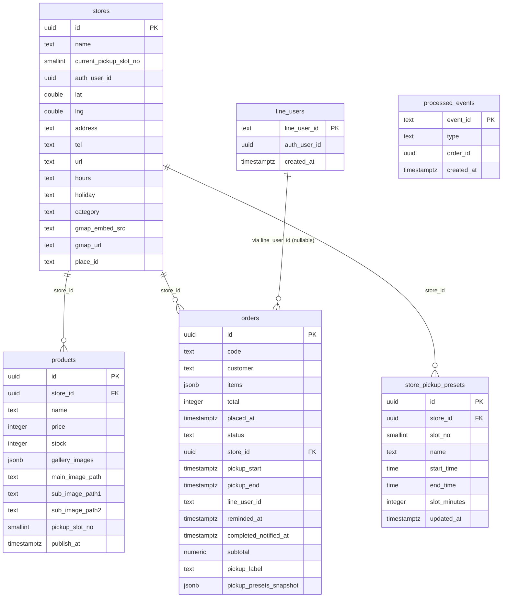

# ARCHITECTURE_MAP

最終更新日（YYYY-MM-DD）: 2025-10-27

- 目次
  - [1. リポジトリ全体像](#1-リポジトリ全体像)
  - [2. 依存関係とパスエイリアス](#2-依存関係とパスエイリアス)
  - [3. ドメイン/機能別の所有ファイル](#3-ドメイン機能別の所有ファイル)
  - [4. ランタイムシーケンス](#4-ランタイムシーケンス)
  - [5. API/エンドポイント索引](#5-apiエンドポイント索引)
  - [5.1 入出力サンプル JSON](#51-入出力サンプル-json)
  - [6. データモデル--スキーマ](#6-データモデル--スキーマ)
  - [6.1 RLS/ポリシー詳細](#61-rlspolicy詳細)
  - [7. 設定--環境変数](#7-設定--環境変数)
  - [8. エラーハンドリングと運用](#8-エラーハンドリングと運用)
  - [9. ビルド--デプロイ--ローカル実行](#9-ビルド--デプロイ--ローカル実行)
  - [10. 変更容易性のためのガイド](#10-変更容易性のためのガイド)
  - [付録A. クロスリファレンス索引](#付録a-クロスリファレンス索引)
  - [更新手順（再生成方法）](#更新手順再生成方法)


## 1. リポジトリ全体像
（根拠: `pnpm-workspace.yaml`, `package.json`, `apps/*`, `packages/*`）

- ルート構成（最大3階層、…は省略）
```
/                           
├─ apps/                   
│  ├─ store/               
│  │  ├─ src/app/...       
│  │  ├─ src/lib/...       
│  │  └─ src/types/...     
│  └─ user/                
│     ├─ src/app/...       
│     └─ src/lib/...       
├─ packages/
│  └─ shared/
├─ supabase/
│  ├─ migrations/
│  └─ backup/
├─ docs/ （正式ドキュメント）
└─ document/ （参考、docs 優先）
```
- 主要 package.json スクリプト
  - ルート `package.json`: `dev`（両アプリ同時起動）, `dev:store`, `dev:user`, `seed:stores:locations`（店舗座標投入）（根拠: `package.json:6-18`）
  - `apps/store/package.json`: `dev`（:3001）, `build`, `start`, `lint`（根拠: `apps/store/package.json`）
  - `apps/user/package.json`: `dev`（:3002）, `build`, `start`（:3002）, `lint`（根拠: `apps/user/package.json`）
- フレームワーク/主要バージョン
  - Next.js 15.5.4（両アプリ）/ React 19.1.0 / TS ^5.9.3（根拠: `apps/*/package.json`）
  - Supabase JS ^2.74.0, Stripe ^19.1.0（server）, `@stripe/stripe-js` ^8.1.0（client）, LIFF ^2.27.2（根拠: ルート `package.json`, `apps/user/package.json`）
- App Router 採用（`src/app/**` に `route.ts`/ページ）（根拠: `apps/*/src/app/**`）


## 2. 依存関係とパスエイリアス
（根拠: ルート・各 app の `package.json`, `tsconfig.json`）

- 主要依存の用途（例示）
  - `@supabase/supabase-js`: DB/Storage/Realtime 連携（例: クライアント生成 `apps/user/src/lib/supabase.ts`, サービスロール `apps/user/src/lib/supabaseServer.ts`）
  - `stripe`（server）/`@stripe/stripe-js`・`@stripe/react-stripe-js`（client）: 決済・Checkout/Webhook（例: `apps/user/src/app/api/stripe/create-checkout-session/route.ts`, `apps/user/src/app/api/stripe/webhook/route.ts`）
  - `@line/liff`: LIFF 初期化/サイレントログイン（例: `apps/store/src/app/LiffBoot.tsx`）
  - `leaflet`/`react-leaflet`: 地図表示（例: `apps/user/src/components/MapView.tsx`）
- パスエイリアス（両アプリ共通）
  - `@/*` → `./src/*`（根拠: `apps/user/tsconfig.json`, `apps/store/tsconfig.json`）
- 依存関係グラフ（概要）



## 3. ドメイン/機能別の所有ファイル
（根拠: 各 `apps/*/src/**`、該当ファイルへのリンク）

- 1行定義（責務）
  - 決済（Stripe）: Checkout セッション生成/完了 Webhook/在庫減算/プレオーダー作成
  - 受取時間判定: プリセットスロットの構築と選択 UI、JST 変換
  - 注文/プレオーダー: `orders` への PENDING 事前登録と確定更新
  - LINE連携: LIFF 初期化、Webhook、Push、絞り込みボタン
  - 画像アップロード: Sharp での変換と Supabase Storage 保存
  - 店舗プリセット: `store_pickup_presets` の upsert と `stores.current_pickup_slot_no` 制御

- 中核ファイル（抜粋）

| Path | 主要エクスポート | 入口 | 外部依存 | 呼び出し元/先 | 備考 |
|---|---|---|---|---|---|
| apps/user/src/app/api/stripe/create-checkout-session/route.ts | POST | Route Handler | Stripe, Supabase REST | フロントから呼ばれる | PENDINGのプレオーダー作成、metadataへ snapshot 添付（TODO(req v2)含む） |
| apps/user/src/app/api/stripe/webhook/route.ts | POST/GET | Route Handler | Stripe | Stripe→当API | processed_events による冪等化、orders を確定更新＋LINE Push |
| apps/user/src/app/api/stripe/fulfill/route.ts | GET | Route Handler | Stripe, Supabase REST | Checkout 完了後の取得 | 在庫減算処理あり（TODO(req v2): 取引整流化） |
| apps/user/src/components/PickupTimeSelector.tsx | React | UI | Supabase Realtime | ユーザー UI | 近接閾値/リードカットオフ（警告/ブロック）実装 |
| apps/store/src/app/api/store/orders/complete/route.ts | POST | Route Handler | Supabase, LINE | 店側 UI | status を COMPLETED に更新し LINE へ Push（idempotent flag 更新） |
| apps/store/src/app/api/store/pickup-presets/route.ts | POST | Route Handler | Supabase | 店側 UI | `store_pickup_presets` upsert と `stores.current_pickup_slot_no` 更新 |
| apps/store/src/app/LiffBoot.tsx | React | CSR Init | @line/liff | store レイアウト | LIFF init と silent-login（環境によりスキップ） |
| apps/store/src/app/api/images/upload/route.ts | POST | Route Handler | sharp, Supabase Storage | 店側 UI | 複数プリセットサイズの画像生成＋公開URL生成 |
| apps/user/src/lib/code6.ts | fn | — | — | 双方で参照 | 6桁コード正規化（比較はこれを使用） |

検索パターン: `rg -n "apps/(user|store)/src/(app|lib)/.*\.(ts|tsx)$"`


## 4. ランタイムシーケンス

### 4.1 カート→Stripe Checkout 作成→成功→Webhook→注文確定
（根拠: `apps/user/src/app/api/stripe/create-checkout-session/route.ts`, `apps/user/src/app/api/stripe/webhook/route.ts`, `apps/user/src/app/api/stripe/fulfill/route.ts`）


- DB参照/更新: `public.orders(id, code, items, total, placed_at, status, pickup_start, pickup_end, pickup_label, pickup_presets_snapshot)`、`public.products(stock)`（在庫減算）

### 4.2 受取時間の判定（プリセット/時間外確認）
（根拠: `apps/user/src/components/PickupTimeSelector.tsx`, `apps/user/src/lib/pickupSlots.ts`）


- DB参照: `stores(current_pickup_slot_no)`, `store_pickup_presets(slot_no,name,start_time,end_time,slot_minutes)`
- Webhook/Checkout 側では `pickup_label` を `HH:MM–HH:MM` から JST ISO に変換して `orders.pickup_start/end` に保存（根拠: `create-checkout-session`, `webhook`）

### 4.3 コード照合（6桁）と店舗側の裁量承認
（根拠: `apps/user/src/lib/code6.ts`, `apps/store/src/app/page.tsx` 内の比較/更新、`apps/store/src/app/api/store/orders/complete/route.ts`）


- DB更新: `public.orders(status)` を店側で COMPLETED に（ユーザー UI では redeemed として扱う互換）（根拠: `apps/store/src/app/api/store/orders/complete/route.ts`）


### UI コンポーネント遷移図（各フロー）
（根拠: `apps/user/src/app/page.tsx`, `apps/user/src/components/PickupTimeSelector.tsx`, `apps/user/src/app/checkout/*/page.tsx`, `apps/store/src/app/page.tsx`, `apps/store/src/app/{SupabaseBoot,LiffBoot,StoreGuard}.tsx`）

1) Checkout 作成～確定

```mermaid
flowchart LR
  U0["user/page.tsx"] --> U1["PickupTimeSelector.tsx"]
  U1 -->|onSelect(label)| U2[/POST /api/stripe/create-checkout-session/]
  U2 --> U3["Stripe Embedded (client_secret)"]
  U3 -->|success| U4["/checkout/complete/page.tsx"]
  U3 -->|cancel| U5["/checkout/cancel/page.tsx"]
  Stripe[[Stripe]] --> WH[/POST /api/stripe/webhook/]
```

2) 受取時間の判定（UI内）



3) 6桁コード照合～店舗承認




## 5. API/エンドポイント索引
（根拠: `apps/*/src/app/api/**/route.ts`）

- user アプリ
  - POST `/api/stripe/create-checkout-session` → `apps/user/src/app/api/stripe/create-checkout-session/route.ts`
    - Body: { storeId?, userEmail?, lines[{id,name,price,qty}], pickup?, returnUrl }
    - Returns: { client_secret }
    - 外部: Stripe, Supabase REST（orders 事前登録）。エラー: 400/401/500
  - POST `/api/stripe/checkout` → `apps/user/src/app/api/stripe/checkout/route.ts`
    - Body: { userEmail?, storeId?, pickupLabel?, lines[] }
    - Returns: { id, client_secret }
  - GET `/api/stripe/fulfill` → `apps/user/src/app/api/stripe/fulfill/route.ts`
    - Query: session_id
    - Stripe セッション検証後、orders 読取/在庫減算。Returns: { ok, order }
  - POST `/api/stripe/create-intent` → `apps/user/src/app/api/stripe/create-intent/route.ts`
    - Body: { storeId, userEmail, lines[], pickup }
    - Returns: { client_secret }（PaymentIntent）
  - POST `/api/stripe/webhook` → `apps/user/src/app/api/stripe/webhook/route.ts`
    - Header: stripe-signature 必須
    - 処理: processed_events による重複防止、orders 確定更新、LINE Push
    - エラー: 400/200（外形上OK返し）
  - POST `/api/orders/confirm` → `apps/user/src/app/api/orders/confirm/route.ts`
    - Body: { items[{sku,qty}], total, pickupStart?, storeId?, customer? }
    - Cookie: user_session（HMAC）で line_user_id 確認
    - Returns: { ok, orderId }
  - POST `/api/orders/confirm_v2` → `apps/user/src/app/api/orders/confirm_v2/route.ts`
  - POST `/api/checkout/embedded` → `apps/user/src/app/api/checkout/embedded/route.ts`
  - POST `/api/cron/remind-pickup` → `apps/user/src/app/api/cron/remind-pickup/route.ts`（Authorization: Bearer CRON_SECRET 任意）
  - POST `/api/cron/thank-completed` → `apps/user/src/app/api/cron/thank-completed/route.ts`
  - POST `/api/line/webhook` → `apps/user/src/app/api/line/webhook/route.ts`（x-line-signature 必須）
  - POST `/api/line/attach` → `apps/user/src/app/api/line/attach/route.ts`
  - POST `/api/dev/line/push` → `apps/user/src/app/api/dev/line/push/route.ts`
  - GET `/api/maps-static` → `apps/user/src/app/api/maps-static/route.ts`
  - GET `/api/osrm` → `apps/user/src/app/api/osrm/route.ts`
  - 互換: POST `/api/create-checkout-session` → `apps/user/src/app/api/create-checkout-session/route.ts`

- store アプリ
  - POST `/api/auth/login/password` → `apps/store/src/app/api/auth/login/password/route.ts`
  - GET `/api/auth/session/inspect` → `apps/store/src/app/api/auth/session/inspect/route.ts`
  - GET `/api/auth/session/list-stores` → `apps/store/src/app/api/auth/session/list-stores/route.ts`
  - POST `/api/auth/session/select-store` → `apps/store/src/app/api/auth/session/select-store/route.ts`
  - POST `/api/auth/session/set-store` → `apps/store/src/app/api/auth/session/set-store/route.ts`
  - POST `/api/auth/line/silent-login` → `apps/store/src/app/api/auth/line/silent-login/route.ts`
  - POST `/api/store/pickup-presets` → `apps/store/src/app/api/store/pickup-presets/route.ts`
  - POST `/api/store/orders/complete` → `apps/store/src/app/api/store/orders/complete/route.ts`
  - POST `/api/images/upload` → `apps/store/src/app/api/images/upload/route.ts`
  - POST `/api/images/delete` → `apps/store/src/app/api/images/delete/route.ts`
  - GET/POST `/api/admin/tools/bootstrap-auth-users` → `apps/store/src/app/api/admin/tools/bootstrap-auth-users/route.ts`
  - POST `/api/admin/tools/reset-store-passwords` → `apps/store/src/app/api/admin/tools/reset-store-passwords/route.ts`
  - POST `/api/admin/approve-store` → `apps/store/src/app/api/admin/approve-store/route.ts`
  - GET `/api/admin/store-applications/list` → `apps/store/src/app/api/admin/store-applications/list/route.ts`
  - POST `/api/dev/set-password` → `apps/store/src/app/api/dev/set-password/route.ts`

…他 N件（検索: `rg -n "apps/(user|store)/src/app/api/.*/route\.ts"`）


## 5.1 入出力サンプル JSON
（根拠: 各 `route.ts` 実装）

注意: 実際の応答は状況により異なります。必須ヘッダ（署名/認証）は各項目の説明に従ってください。

- POST `/api/stripe/create-checkout-session`（apps/user/.../create-checkout-session/route.ts）
  - Request
    ```json
    {
      "storeId": "00000000-0000-0000-0000-000000000000",
      "userEmail": "user@example.com",
      "lines": [
        { "id": "prod-1", "name": "パン詰め合わせ", "price": 500, "qty": 2 }
      ],
      "pickup": "18:00–19:00",
      "returnUrl": "https://example.com/checkout/complete"
    }
    ```
  - Response
    ```json
    { "client_secret": "cs_test_xxx" }
    ```

- POST `/api/stripe/checkout`（apps/user/.../stripe/checkout/route.ts）
  - Request
    ```json
    {
      "userEmail": "user@example.com",
      "storeId": "00000000-0000-0000-0000-000000000000",
      "pickupLabel": "18:00–19:00",
      "lines": [
        { "id": "prod-1", "name": "パン", "price": 500, "qty": 1 }
      ]
    }
    ```
  - Response
    ```json
    { "id": "cs_test_123", "client_secret": "cs_test_xxx" }
    ```

- GET `/api/stripe/fulfill?session_id=cs_test_123`（apps/user/.../stripe/fulfill/route.ts）
  - Response
    ```json
    {
      "ok": true,
      "order": {
        "id": "0b8c...",
        "userEmail": "user@example.com",
        "shopId": "00000000-0000-0000-0000-000000000000",
        "amount": 1000,
        "status": "paid",
        "code6": "012345",
        "createdAt": 1730000000000,
        "lines": [
          {
            "shopId": "00000000-0000-0000-0000-000000000000",
            "item": { "id": "prod-1", "name": "パン", "price": 500, "stock": 0, "pickup": "18:00–19:00", "note": "", "photo": "???" },
            "qty": 2
          }
        ]
      }
    }
    ```

- POST `/api/stripe/webhook`（apps/user/.../stripe/webhook/route.ts）
  - Header: `stripe-signature: ...`
  - Response（成功時テキスト）
    ```
    ok
    ```

- POST `/api/orders/confirm`（apps/user/.../orders/confirm/route.ts）
  - Request
    ```json
    {
      "items": [ { "sku": "sku-1", "qty": 1 } ],
      "total": 500,
      "pickupStart": "2025-10-27T09:00:00+09:00",
      "storeId": "00000000-0000-0000-0000-000000000000",
      "customer": "user@example.com"
    }
    ```
  - Response
    ```json
    { "ok": true, "orderId": "0b8c..." }
    ```

- POST `/api/orders/confirm_v2`（apps/user/.../orders/confirm_v2/route.ts）
  - Request/Response は v1 と同等。`x-orders-confirm: user-app@v2` ヘッダが付与されます。

- POST `/api/checkout/embedded`（apps/user/.../checkout/embedded/route.ts）
  - Request
    ```json
    {
      "amount": 1200,
      "currency": "jpy",
      "email": "user@example.com",
      "metadata": { "note": "テスト" },
      "returnUrl": "https://example.com/checkout/complete"
    }
    ```
  - Response
    ```json
    { "client_secret": "cs_test_xxx" }
    ```

- POST `/api/cron/remind-pickup`（apps/user/.../cron/remind-pickup/route.ts）
  - Header（任意）: `Authorization: Bearer <CRON_SECRET>`
  - Response（代表例）
    ```json
    { "ok": true, "skipped": true, "reason": "disabled" }
    ```

- POST `/api/cron/thank-completed`（apps/user/.../cron/thank-completed/route.ts）
  - Header（任意）: `Authorization: Bearer <CRON_SECRET>`
  - Response
    ```json
    { "ok": true, "picked": 3, "pushed": 3, "updated": 3, "skipped": 0, "failures": [] }
    ```

- POST `/api/line/webhook`（apps/user/.../line/webhook/route.ts）
  - Header: `x-line-signature: ...`
  - Body: LINE Messaging API webhook JSON（そのまま）
  - Response
    ```json
    { "ok": true, "collected": 1, "upserted": 1 }
    ```

- POST `/api/line/attach`（apps/user/.../line/attach/route.ts）
  - Request
    ```json
    { "id_token": "<LIFF ID Token>" }
    ```
  - Response（Cookie: user_session 設定）
    ```json
    { "ok": true, "line_user_id": "Uxxxxxxxx" }
    ```

- GET `/api/maps-static?lat=35.0&lng=135.0&zoom=15&size=600x400`（apps/user/.../maps-static/route.ts）
  - Response: 画像バイナリ（Content-Type: image/png 等）

- GET `/api/osrm?profile=walking&origin=35.0,135.0&dest=35.01,135.01&overview=false`（apps/user/.../osrm/route.ts）
  - Response: OSRM の JSON をそのまま透過

- POST `/api/store/pickup-presets`（apps/store/.../store/pickup-presets/route.ts）
  - Request
    ```json
    {
      "rows": [
        { "slot_no": 1, "name": "通常", "start_time": "10:00:00", "end_time": "14:00:00", "slot_minutes": 20 },
        { "slot_no": 2, "name": "夕方", "start_time": "17:00:00", "end_time": "19:00:00", "slot_minutes": 10 }
      ],
      "current_slot_no": 2
    }
    ```
  - Response
    ```json
    { "ok": true }
    ```

- POST `/api/store/orders/complete`（apps/store/.../store/orders/complete/route.ts）
  - Request
    ```json
    { "orderId": "0b8c..." }
    ```
  - Response（例）
    ```json
    { "ok": true, "pushed": 1, "updated": 1, "skipped": 0, "orderId": "0b8c..." }
    ```

- POST `/api/images/upload`（apps/store/.../images/upload/route.ts）
  - Request（multipart/form-data）: fields `productId`, `slot`("main"|"sub1"|"sub2"), `file`
  - Response
    ```json
    {
      "ok": true,
      "path": "products/<productId>/<uuid>_main_1280.webp",
      "variants": [
        { "width": 320, "path": "..._320.webp", "url": "https://..." },
        { "width": 640, "path": "..._640.webp", "url": "https://..." }
      ]
    }
    ```

- POST `/api/images/delete`（apps/store/.../images/delete/route.ts）
  - Request
    ```json
    { "productId": "...", "slot": "main" }
    ```
  - Response
    ```json
    { "ok": true }
    ```

- 認証/セッション系（store）
  - POST `/api/auth/login/password` → `{ "email": "...", "password": "..." }` → `{ ok: true, operator_user_id, store_id? }`（Cookie: store_session）
  - GET `/api/auth/session/inspect` → `{ ok: true, store_id: "..." | null }`
  - GET `/api/auth/session/list-stores` → `{ ok: true, stores: [ { id, name } ] }`
  - POST `/api/auth/session/select-store` → `{ storeId }` → `{ ok: true, store_id }`

## 6. データモデル & スキーマ
（根拠: `docs/最新DB構成.md`, `supabase/migrations/*.sql`）



- インデックス（抜粋）: `idx_orders_pickup_start_status`, `idx_orders_line_user_id`, `idx_orders_completed_notify`（根拠: `supabase/migrations/20251024_*.sql`, `20251025_*.sql`）
- RLS ポリシー要点（抜粋、店側テーブル）: `stores`, `store_pickup_presets`, `store_members` における auth.uid() と store_members に基づく select/update 制御（根拠: `supabase/migrations/20251023_store_rls.sql`）。
- 備考: Webhook 冪等化テーブル `processed_events` を導入（根拠: `20251025_processed_events.sql`）。


## 7. 設定/環境変数
（根拠: `.env.example`, 各コードの `process.env.*` 参照）

- キー一覧（抜粋）
  - 共通: `NEXT_PUBLIC_SUPABASE_URL`, `NEXT_PUBLIC_SUPABASE_ANON_KEY`
  - User/Stripe: `STRIPE_SECRET_KEY`, `STRIPE_WEBHOOK_SECRET`, `NEXT_PUBLIC_STRIPE_PUBLISHABLE_KEY`（参照: `apps/user/src/app/page.tsx`）
  - Store 認証: `STORE_SESSION_SECRET` または `ADMIN_DASHBOARD_SECRET`/`LINE_LOGIN_CHANNEL_SECRET`
  - Supabase 管理: `SUPABASE_SERVICE_ROLE_KEY`, `SUPABASE_URL`
  - LINE: `LINE_CHANNEL_ACCESS_TOKEN`, `LINE_CHANNEL_SECRET`, `USER_LIFF_ID`, `NEXT_PUBLIC_LIFF_ID`
  - Cron: `CRON_SECRET`, `THANK_YOU_COMPLETED_ENABLED`
- 主な利用箇所リンク
  - Supabase（client）: `apps/user/src/lib/supabase.ts`, `apps/store/src/lib/supabaseClient.ts`
  - Supabase（service）: `apps/user/src/lib/supabaseServer.ts`, 多数の Route Handler
  - Stripe: `apps/user/src/app/api/stripe/*/route.ts`
  - LINE Push/Webhook: `apps/user/src/lib/line.ts`, `apps/user/src/app/api/line/webhook/route.ts`, `apps/store/src/app/api/store/orders/complete/route.ts`
  - LIFF: `apps/store/src/app/LiffBoot.tsx`
- Webhook/Redirect/Callback URL（判明範囲）
  - Stripe Webhook: `POST {USER_BASE_URL}/api/stripe/webhook`
  - Stripe Embedded return_url: `NEXT_PUBLIC_BASE_URL` 経由で `/checkout/return?session_id=...`（根拠: `apps/user/src/app/api/stripe/checkout/route.ts`）
  - LINE Webhook: `POST {USER_BASE_URL}/api/line/webhook`


## 8. エラーハンドリングと運用
（根拠: 各 Route の `NextResponse.json`, `console.error` 等）

- 代表的失敗パターン
  - 401 unauthorized（HMAC セッション/LINE署名/Stripe署名不備）: `orders/confirm(_v2)`, `line/webhook`, `stripe/webhook`
  - 400 bad request（入力不備）: `create-checkout-session` など
  - 405 Method Not Allowed: 多くの Route に GET ガード（例: `apps/user/src/app/api/stripe/webhook/route.ts`）
  - 403 membership-not-found（店舗メンバー権限不足）: `store/orders/complete`, `auth/session/select-store`
  - RLS 相当の失敗は Supabase 返却文面として `... failed` をログ（在庫更新等）
- ログ出力
  - `console.error/console.warn/console.info` のみ（SaaS連携なし）
- リトライ/冪等
  - Stripe Webhook: `processed_events` によりイベントIDの重複処理を抑止（根拠: `apps/user/src/app/api/stripe/webhook/route.ts`, `supabase/migrations/20251025_processed_events.sql`）
  - LINE Push: 失敗は warn ログに留め、処理継続


## 9. ビルド/デプロイ/ローカル実行
（根拠: ルート/各 app の `package.json`）

- ローカル起動
  - `pnpm i`
  - `pnpm dev`（store: http://localhost:3001, user: http://localhost:3002）
- 個別起動: `pnpm dev:store` / `pnpm dev:user`
- 本番ビルド/起動（各アプリ）: `pnpm -C apps/store build && pnpm -C apps/store start`、`pnpm -C apps/user build && pnpm -C apps/user start`
- マイグレーション/型生成
  - SQL は `supabase/migrations/` に手書き格納（Supabase CLI チェーン外の TODO が記載）
  - 型生成は未導入（TODO(req v2): gen types）


## 10. 変更容易性のためのガイド
（根拠: 各該当ファイル）

- 注文確定時の通知文言を変更
  - 変更先: `apps/user/src/app/api/stripe/webhook/route.ts`（LINE Push 部分）, `apps/store/src/app/api/store/orders/complete/route.ts`（店舗→ユーザー完了通知）
  - 影響: 文言のみ。API 仕様や DB 変更なし
- 受取判定の閾値（近接/ブロック）を変更
  - 変更先: `apps/user/src/components/PickupTimeSelector.tsx` の `nearThresholdMin`/`leadCutoffMin` デフォルト
- Webhook メタデータに項目追加（例: 配送メモ）
  - 追加先: `apps/user/src/app/api/stripe/create-checkout-session/route.ts` の `metadata`/`payment_intent_data.metadata`
  - 受け側: `apps/user/src/app/api/stripe/webhook/route.ts` で抽出し `orders` のカラムに保存（必要なら `supabase/migrations` に列追加）
- 6桁コード照合ルールの変更
  - 変更先: `apps/user/src/lib/code6.ts`（normalize のみで統一）。store 側は `apps/store/src/app/page.tsx:116` の同等実装
- 店舗受取プリセットの保存ロジック
  - 変更先: `apps/store/src/app/api/store/pickup-presets/route.ts`（セッション/権限/アップサート）。LIFFサインド更新版は `apps/store/src/app/api/presets/upsert/route.ts`


## 付録A. クロスリファレンス索引

- 機能 → ファイル
  - 決済/Checkout: `apps/user/src/app/api/stripe/create-checkout-session/route.ts`, `apps/user/src/app/api/stripe/checkout/route.ts`
  - Webhook 確定: `apps/user/src/app/api/stripe/webhook/route.ts`
  - Fulfill（在庫/応答）: `apps/user/src/app/api/stripe/fulfill/route.ts`
  - 受取時間UI/プリセット: `apps/user/src/components/PickupTimeSelector.tsx`, `apps/store/src/app/api/store/pickup-presets/route.ts`
  - 6桁コード: `apps/user/src/lib/code6.ts`, `apps/store/src/app/page.tsx`
  - 画像アップロード: `apps/store/src/app/api/images/upload/route.ts`
  - LINE Webhook/Push: `apps/user/src/app/api/line/webhook/route.ts`, `apps/user/src/lib/line.ts`

- ファイル → 依存
  - `apps/user/src/app/api/stripe/webhook/route.ts` → Stripe, Supabase REST, processed_events, LINE Push
  - `apps/user/src/components/PickupTimeSelector.tsx` → Supabase（select + Realtime）
  - `apps/store/src/app/api/store/orders/complete/route.ts` → Supabase（RLS前提）, LINE Push
  - `apps/store/src/app/api/images/upload/route.ts` → sharp, Supabase Storage

- 用語集（定義）
  - プレオーダー: Checkout 前に `orders(status=PENDING)` を作成し、Webhookで確定情報を補完
  - 店舗受取可能時間（プリセット）: `store_pickup_presets` と `stores.current_pickup_slot_no` により定義されるスロット集合
  - pickup_label: `HH:MM–HH:MM` の人間可読ラベル。Webhookで `pickup_start/end` にISO化
  - 6桁コード（code6）: `orders.code` の6桁表現。比較は `normalizeCode6` で正規化して一致判定


## 更新手順（再生成方法）
- 依存グラフ（任意）: `npx depcruise src --include-only "^apps/(user|store)" --output-type mermaid`
- 未使用エクスポート（任意）: `npx ts-prune`
- ルートツリー（任意）: `git ls-files` を整形
- 本ドキュメントはコード参照に基づき手動生成。構成更新時は `rg -n "apps/(user|store)/src/app/api/.*/route\.ts"` で API を差分確認し更新する。

## 6.1 RLS/ポリシー詳細
（根拠: supabase/migrations/20251023_store_rls.sql, docs/db要件定義・仕様（rls厳格化／店舗別アクセス）.md）

- stores（行レベルセキュリティ）
  - select/update/delete: 所有者（stores.auth_user_id = auth.uid()）または store_members(role in owner,admin,staff) に許可
  - 出典: 20251023_store_rls.sql 内 stores_select_self/stores_update_self/stores_delete_self

- store_pickup_presets（行レベルセキュリティ）
  - select/all(using/with check): stores.auth_user_id または store_members 経由で当該 store_id に紐づく行に限定
  - 出典: 20251023_store_rls.sql 内 spp_select_self/spp_modify_self

- store_members（行レベルセキュリティ）
  - select: 所有者またはその店舗のメンバー
  - all(using/with check): 所有者/管理者（owner,admin）のみ変更可
  - 出典: 20251023_store_rls.sql 内 sm_select_self/sm_modify_owner_admin

- orders（JWT の store_id クレームに基づく厳格アクセス）
  - docs 設計: orders は JWT の store_id と行の store_id が一致するものに限定して select/insert/update/delete を許可
  - 代表 SQL（docs より）
`
ALTER TABLE public.orders ENABLE ROW LEVEL SECURITY;
ALTER TABLE public.orders FORCE ROW LEVEL SECURITY;
CREATE POLICY orders_select ON public.orders
  FOR SELECT TO authenticated
  USING ((current_setting('request.jwt.claims', true)::json->>'store_id')::uuid = store_id);
-- insert/update/delete も同様の with check / using 条件
`
  - 備考: 実DBへの適用は移行チェーンに統合（TODO(req v2)）。

- Realtime/複製設定
  - orders は Realtime で UPDATE を購読対象。差分精度向上のため REPLICA IDENTITY FULL 推奨（設計ドキュメントに記載）。
